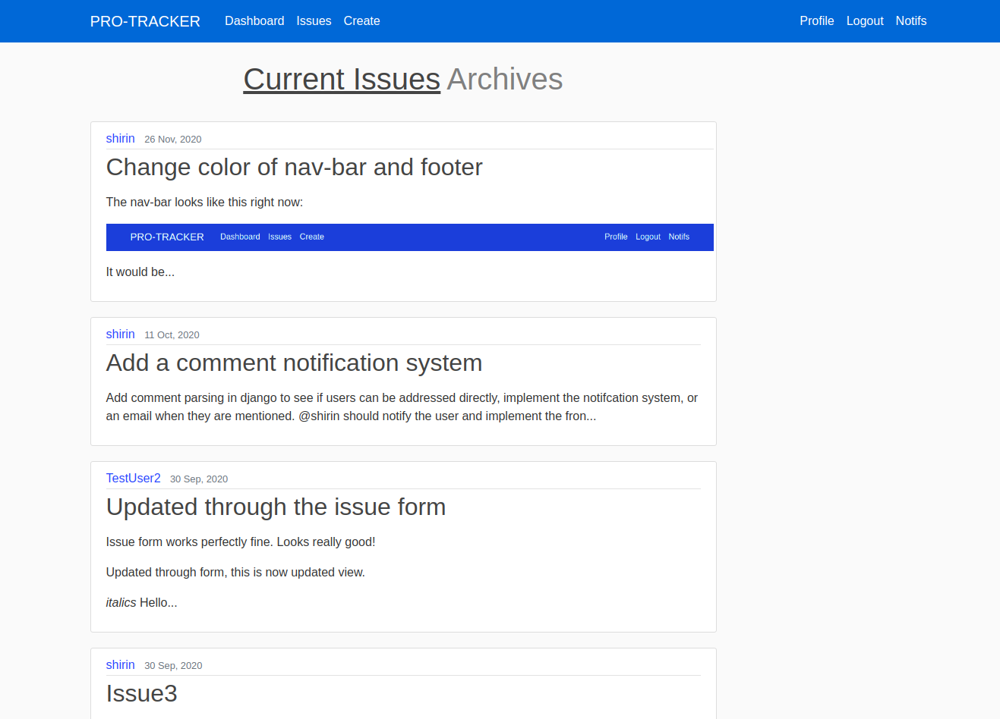

# Pro-tracker
A progress tracking and management tool for fast, productive and smart people who meet deadlines. Due to its simplistic design and intutive workflow, its an ideal collaborative work tool for school and college clubs.

# Run locally
Install the requirements for the project using the requirements.txt file in pro_racker directory. Use the command:
```
pip3 install -r requirements.txt
```


# Features 
1. Create issues, assign multiple people to the same issue.
2. Prioritize your work, by adding a priority status to your issues.
3. Update the issues, adding or removing assigned users, changing priority, etc.
4. After completion, mark the issue as completed an this moves it to the ```issue archives``` page. 
5. See what your club-mates are up to in the issue list.
6. Show your club mates what you are up to, through the sharable profile link which contains your present tasks as well as an archive page for your previous isses.
7. Comment on issues: add links, upload images from the web as well as your local system in a dynamic WYSIYG text editor.
8. Get instant notifications when someone comments on issues that you are a part of.
9. Keep up with your own work using the personalized work dashboard.
10. Get a visual display of your work using dynamic charts which display how many issues you finished versus how many are unfinished per week.
11. Another chart displays number of high, medium and low priority tasks you have left unfinished.
12. Next, the dashboard displays the unfinished projects, sorted by their priorities so that you can get straight to work without wasting time thinking about what to do next!

# Images

## A list of all issues in a club

***

## Details of the issue


***

## Create your own issue


***

## See all importnat things together on with a personalized dashboard


***

## Your own profile with all your work in one place.


***

## Get instantly notified when someone comments on your issues


